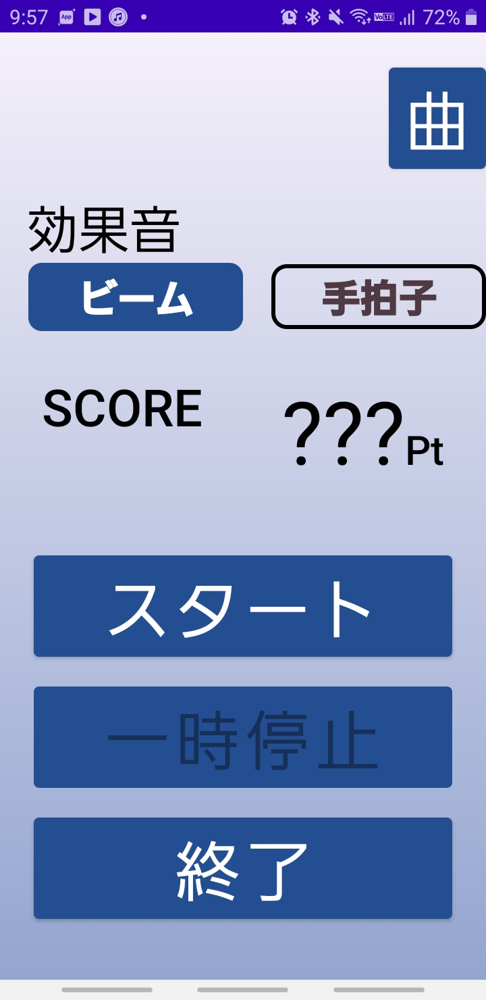
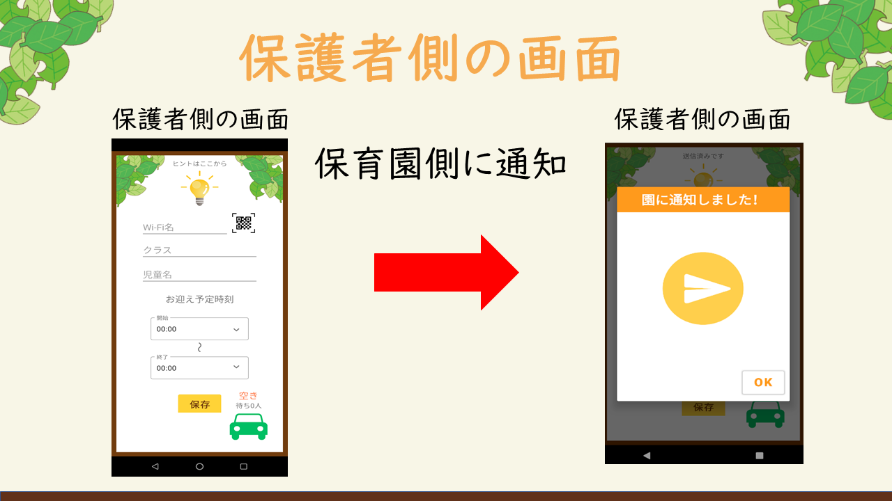
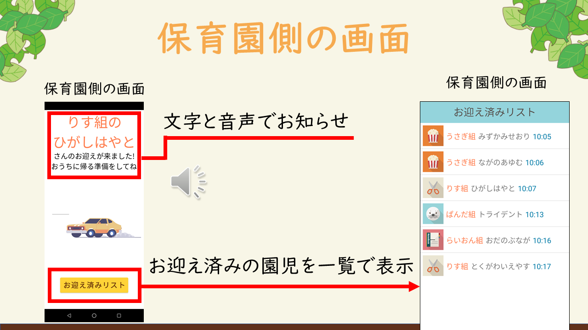
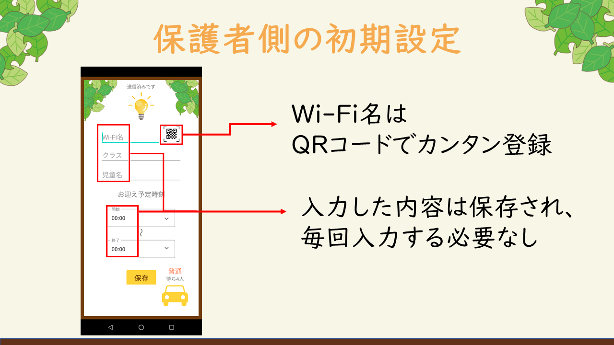
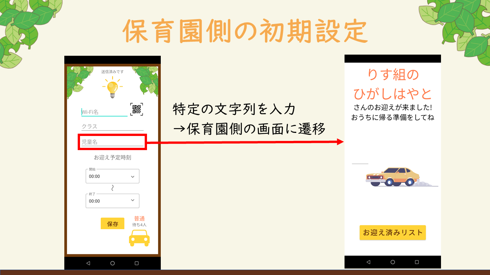
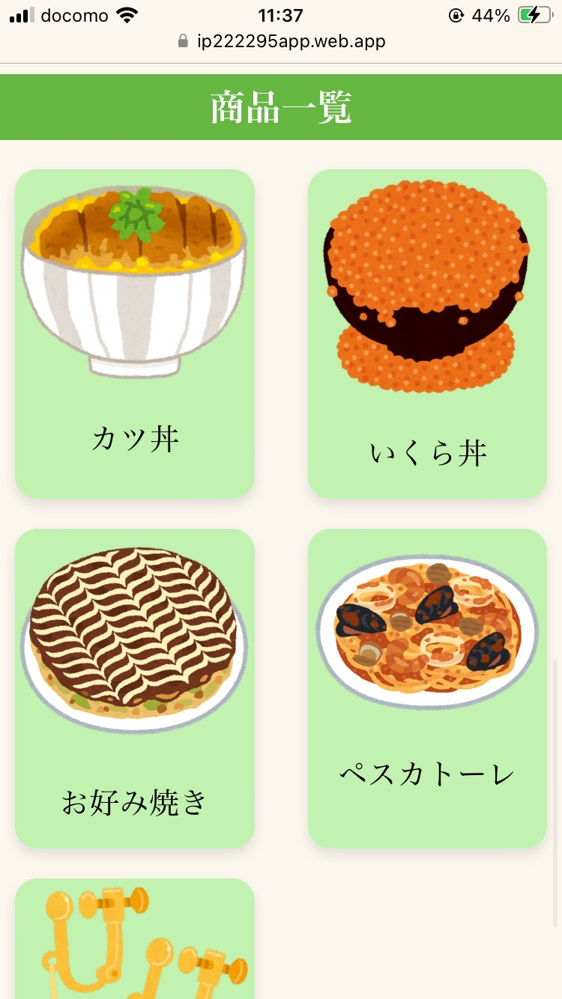

### SmartPhoneSaber

- アプリ概要
	音楽に合わせてスマホを振って遊ぶアプリです。  
	スマホによる若者の運動不足を解消、そして家庭間のコミュニケーションを広げるためのレクリエーションツールとして使えるように制作した。





- 使用方法
	スマホ内の曲と効果音を選択し、スタートボタンを押すと始まります。スマホを振ると効果音が流れます。
	曲に合わせてスマホを振って楽しみましょう。曲が終了するとSCOREが表示されます。

- 制作期間    2023/05/01~2023/7/23
- 制作人数    3人
##### ProtoPediaのURLリンク
```cardlink
url: https://protopedia.net/prototype/4730
title: "SmartPhoneSaber | ProtoPedia"
description: "音楽に合わせてスマホを振って遊ぶアプリです。スマホによる若者の運動不足を解消、そして家庭間のコミュニケーションを広げるためのレクリエーションツールとして使えるように制作した。"
host: protopedia.net
image: https://protopedia.net/pic/ce6c7cec-88ae-423f-9287-abdd107d4cb7.jpg
```

<div style="page-break-after: always;"></div>

### スマートお迎え


- アプリ概要
	「スマートお迎え」は、保護者が保育園に近づいたら、保育園に保護者の接近を音声で通知するアプリ。
	これにより、児童が事前に帰宅の準備ができ、お迎えにかかる時間を短縮することができる。
	また、保育園にいる保護者の人数を保護者の端末に表示する機能もあり、混雑を避けたお迎えができる。
	駐車場の待ち時間を減らすほか、渋滞や路上駐車の緩和にも役立てる。





- 使用方法
	保育園側はWi-FiのSSIDを保護者に配布する。QRコードでの配布を想定しています。
	保護者側は初期設定として、配布されたSSID、クラス名、児童名、お迎え時間を入力してもらいます。
	お迎えのときにアプリを開いておけばSSIDの探知を行い、保育園に近づくと呼び出しを行います。
	保育園側の画面では園児の呼び出しの他に、お迎え済みの園児をを一覧で表示できます。




- 制作期間    2023/05/01~2023/7/23
- 制作人数    3人

##### ProtoPedia及びGitHubのURLリンク
```cardlink
url: https://protopedia.net/prototype/4100
title: "23U220050_スマートお迎え | ProtoPedia"
description: "保護者は保育園のSSID(Wi-Fi名)、クラス名、お子様の名前を登録します。保育園に近づくとSSIDを検知して保育園側の端末で音声呼び出しをしてくれます。"
host: protopedia.net
image: https://protopedia.net/pic/125642fa-8eac-4459-b095-16c3e1389b76.png
```

```cardlink
url: https://github.com/Kei-Adachi0709/SmartPickup
title: "GitHub - Kei-Adachi0709/SmartPickup: Smart Pickup alerts daycare staff when a parent arrives, helping children prepare and reducing pickup time. It also shows the number of parents at the daycare to avoid congestion. Using Wi-Fi SSID detection, it streamlines the process and minimizes parking wait times. 🚀"
description: "Smart Pickup alerts daycare staff when a parent arrives, helping children prepare and reducing pickup time. It also shows the number of parents at the daycare to avoid congestion. Using Wi-Fi SSID ..."
host: github.com
favicon: https://github.githubassets.com/favicons/favicon.svg
image: https://opengraph.githubassets.com/ceb2d0e518cf2bfbfdb7d267c571fecd2105f26a89b7bef1edf9fde4c083e0fd/Kei-Adachi0709/SmartPickup
```

$$ \newline $$

$$ \newline $$

$$ \newline $$


### QR食品表示

- アプリ概要
	飲食店で、どんな食材が使用されているのかわかりにくい商品があると思います。食品の情報をWebアプリに登録することで、今までわかりにくかった情報をお客さんに正確に伝達することができるようになります。
	
 

- 使用方法
	キッチンカーや屋台など、メニュー表にアレルゲンなどの詳細な情報が載っていない場合があります。
	そんな場合に、お店の方には商品の詳細な情報を登録してもらうことで、簡単にインターネット上に掲載することができます。
	お客さんはWebサイトにアクセスすることによって商品の詳細な情報を閲覧したり、条件に合う商品を検索することができます。

- 制作期間    2023/11/15~2024/01/15
- 制作人数    3人
##### ProtoPedia及びGitHubのURLリンク
```cardlink
url: https://protopedia.net/prototype/5781
title: "QR食品表示 | ProtoPedia"
description: "飲食店で、どんな食材が使用されているのかわかりにくい商品があると思います。食品の情報をWebアプリに登録することで、今までわかりにくかった情報をお客さんに正確に伝達することができるようになります。"
host: protopedia.net
image: https://protopedia.net/pic/2567fe95-d79f-4d4a-922c-da2c969a5d09.png
```


```cardlink
url: https://github.com/Kei-Adachi0709/QR-Allergy-Guide
title: "GitHub - Kei-Adachi0709/QR-Allergy-Guide"
description: "Contribute to Kei-Adachi0709/QR-Allergy-Guide development by creating an account on GitHub."
host: github.com
favicon: https://github.githubassets.com/favicons/favicon.svg
image: https://opengraph.githubassets.com/85fb7b701f58f1a26bd9f3da602951e61f96d2c0c51456a77c7aaff4a72fa303/Kei-Adachi0709/QR-Allergy-Guide
```


